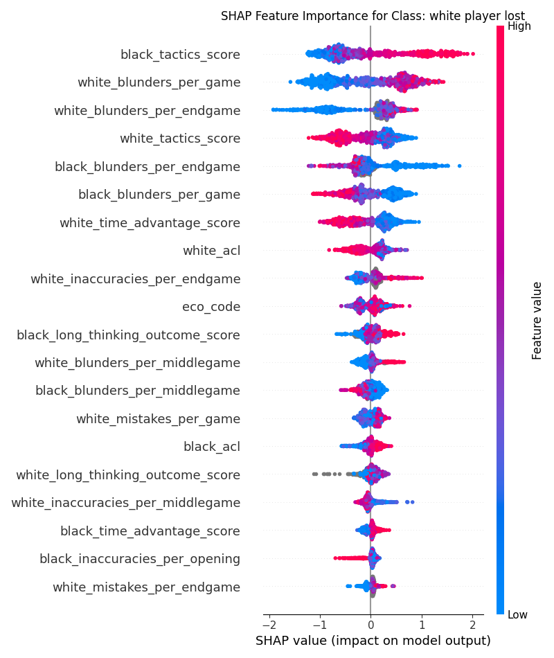
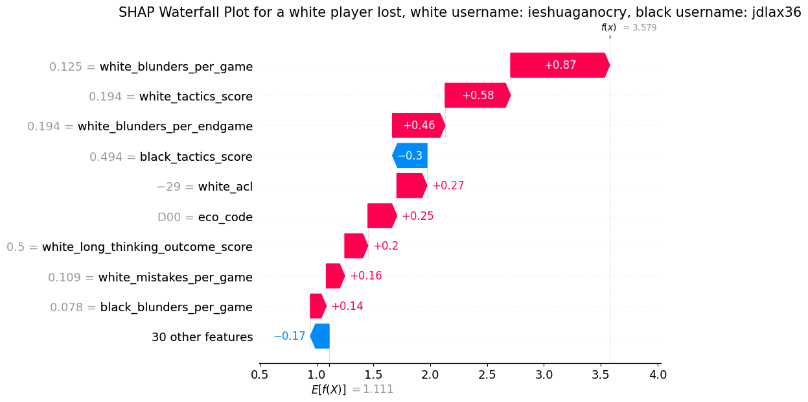
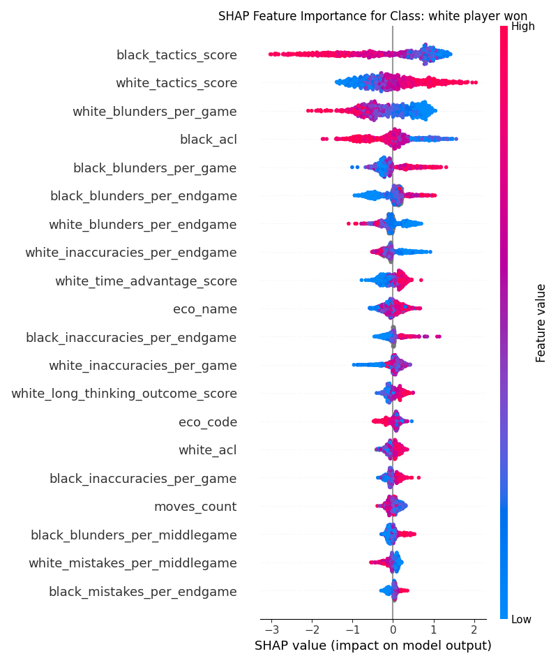
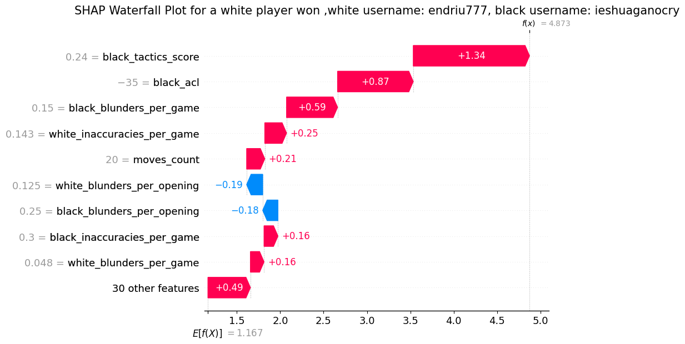
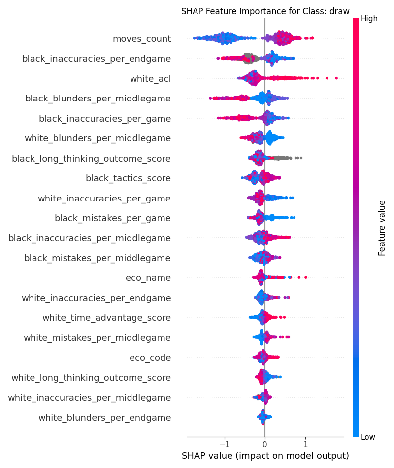
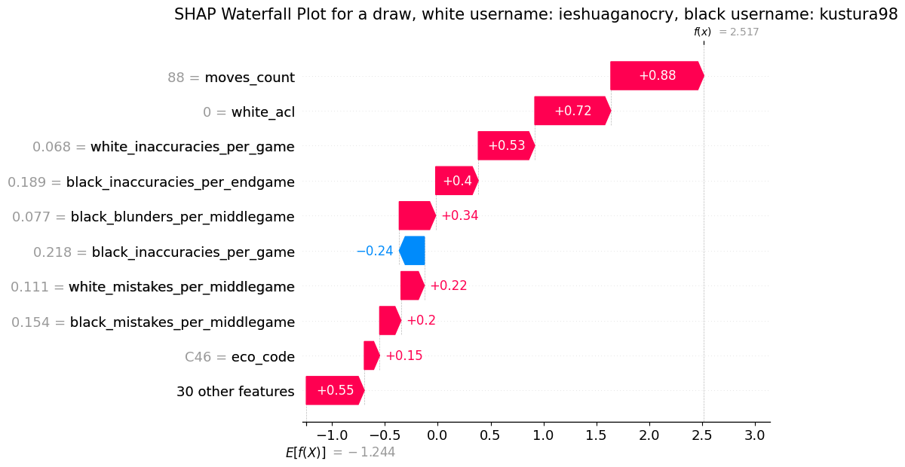

# Report 

This report summarizes the results for doing the chess data exercise, for reproducibility please make sure the directories in the yaml configuration file is correct.
Note that, due to some unknown data formatting issues with the provided chess_games.csv file, and short time frame, I ended saving the file from a google spreadshit into a new csv file 'chess_games_news.csv'

## Data analysis
I chose XGBoost for this task because the chess dataset contains a large number of missing values, and XGBoost handles missing values effectively. I used SHapley Additive exPlanations (SHAP) approach to quantify feature importance by attributing the contribution of each feature to individual predictions, using the XGBoost model. As SHAP offer local explanations for specific predictions and global insights into feature importance, which makes the XGBoost model transparent.

## winrate variables:
There are 10 different columns associated with the past games winrate status of the players -to the best of my knowledge. These winrate contribute significantly to the prediction of the game outcomes. For instance with performing 5 fold cross validation and including the winrates as the covariates/features of an XGBoost model
|          |   Mean |   STD |
|:---------|-------:|------:|
| Accuracy |  0.984 | 0.004 |
| F1-score |  0.984 | 0.004 |
| AUC-ROC  |  0.999 | 0     |

Excluding the winrare variables:
I excluded the winrate variables as they mostly provide information about the past peformance of the players, and as the above table implies they may contribute to overfitting. Therefore all the results provided in this report are based on the excluding the winrate variables.
|          |   Mean |   STD |
|:---------|-------:|------:|
| Accuracy |  0.854 | 0.015 |
| F1-score |  0.836 | 0.017 |
| AUC-ROC  |  0.941 | 0.014 |

## Shap values
The SHAP values are computed for each class separately, to determine the difference in palyer behaviour when they're winning vs losing vs drawing.
### White player lost:
The [white player lost SHAP values](#shap-white-lost) figure illustrates the distribution of SHAP values in population level for the case when the white players lost the game. As the SHAP values implies the most important features contributing the loss of a white player is their opponent tactic 'black_tactics_score', their own critical mistakes-- blunders per game-- and tactics, and not capitalizing their oponent critical mistakes. Please look at the [definition of variables](###Blunder) section at the end of the report markdown.

* individuals:
I used the waterfall plot of SHAP to visualizes the impact of each feature on the model's (XGBoost) prediction for a specific instance, starting from the base value (the average model output) and showing how each feature's SHAP value either increases or decreases the prediction. 
The [a white player lost individual SHAP values](#shap-white-lost-individual) figure indicates that for this specific game, the white player lost mostly due to their own critical mistake and tactic, as compared to the opponent tactic. Interestingly the acl and eco score of the white player indicates that the difference between the white player moves and the chess engine, as well the initial tactic was significantly large. 

 
### White player won:
The [white player won SHAP values](#shap-white-won) figure illustrates the distribution of SHAP values in population level for the case when the white players won the game. As the SHAP values implies the most important features contributing the win of a white player is again first their opponent tactic 'black_tactics_score', second their own tactic and minimal mistakes in following their initial plan, as well as capitalization of their opponent mistakes.

* individuals:
The [a white player won individual SHAP values](#shap-white-won-individual) figure indicates that for this specific game, the main cause of the white player win was black player inappropriate tactic-- aligns with the population SHAP values. Als again the acl score of the black (opponent) player indicates that the opponent made moves were not optimal according to their initial tactics and the chess engine, and it seems the white player was able to capitalize them with minimal mistakes. 

 
### Draw:
The [draw SHAP values](#shap-white-draw) figure illustrates the distribution of SHAP values in population level for the case when the game end result was a draw. As the SHAP values implies given the 'moves_count'-- obviously after too many moves if no player can win the result will be a draw-- no player was able to benefit from their opponent mistakes in general, as there are significant 'blunders', 'inaccuracies', and 'long thinking' contributing to the outcome.

* individual
The [a draw individual SHAP values](#shap-white-draw-individual) figure indicates that for this specific game, after many moves, the players did not make significant mistakes according to the chess engine score, and their 'blunders', 'inaccuracies' were minimal therefore the game ended being a draw.

 

## Definition of variables in the chess dataset

### ELO:
Elo is a rating system used in chess to calculate the relative skill levels of players. The Elo system aims to provide a numerical estimate of a player's strength relative to other players.It was developed by Arpad Elo, a Hungarian-American physics professor and chess master. It's named after him, which is why it's "Elo" not "ELO" (it's not an acronym).
### ECO:
The ECO (Encyclopaedia of Chess Openings) code is a classification system for chess openings. 
Examples of ECO Codes and Names
* A00: Uncommon Opening
* B20: Sicilian Defense
* C00: French Defense
* D00: Queen's Pawn Game
* E00: Catalan Opening

### ACL:
ACL is a measure of the average difference between the moves a player makes and the best moves as determined by a chess engine. It's calculated by analyzing each move in a game and comparing it to the engine's recommended move, then averaging the differences across all moves.

### Blunder:
A blunder in chess is a critically bad mistake that severely worsens a player's position. It typically results in a significant loss of material, a checkmate, or a drastic reduction in the player's chances of winning the game. Blunders can occur at any stage of the game, including the opening, middlegame, and endgame.
